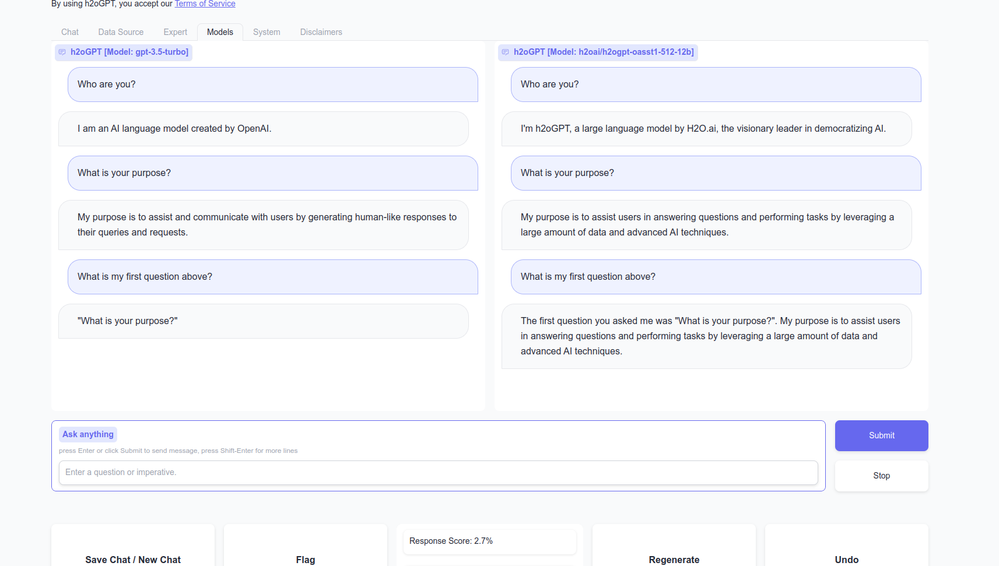
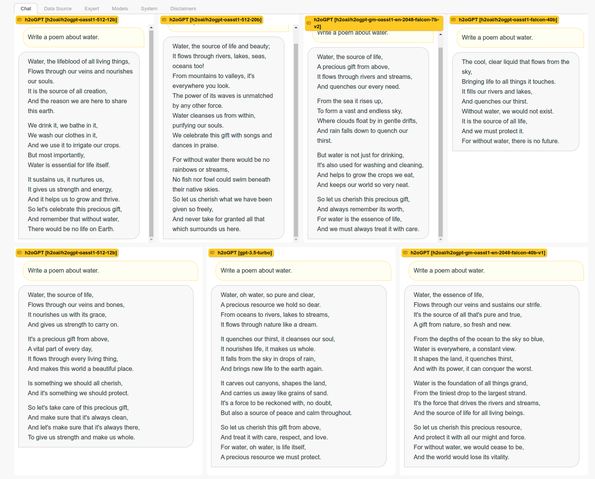

## Hugging Face Text Generation Inference Server-Client

### Local Install

#### **Not Recommended**

This is just following the same [local-install](https://github.com/huggingface/text-generation-inference).
```bash
curl --proto '=https' --tlsv1.2 -sSf https://sh.rustup.rs | sh
source "$HOME/.cargo/env"
```

```bash
PROTOC_ZIP=protoc-21.12-linux-x86_64.zip
curl -OL https://github.com/protocolbuffers/protobuf/releases/download/v21.12/$PROTOC_ZIP
unzip -o $PROTOC_ZIP -d ~/bin bin/protoc
unzip -o $PROTOC_ZIP -d ~/include 'include/*'
rm -f $PROTOC_ZIP
```

```bash
git clone https://github.com/huggingface/text-generation-inference.git
cd text-generation-inference
```

Needed to compile on Ubuntu:
```bash
sudo apt-get install libssl-dev gcc -y
```

Use `BUILD_EXTENSIONS=False` instead of have GPUs below A100.
```bash
conda create -n textgen -y
conda activate textgen
conda install python=3.10 -y
CUDA_HOME=/usr/local/cuda-11.7 BUILD_EXTENSIONS=True make install # Install repository and HF/transformer fork with CUDA kernels
# FIXME: FAILS with lower launcher with flash attn
CUDA_HOME=/usr/local/cuda-11.7 pip install flash_attn
# FIXME: FAILS to build
```

```bash
NCCL_SHM_DISABLE=1 CUDA_VISIBLE_DEVICES=0 text-generation-launcher --model-id h2oai/h2ogpt-oig-oasst1-512-6_9b --port 8080  --sharded false --trust-remote-code --max-stop-sequences=6
```

### Docker Install

#### **Recommended** (instead of Local Install)

```bash
# https://docs.docker.com/engine/install/ubuntu/
sudo snap remove --purge docker
sudo apt-get update
sudo apt-get install ca-certificates curl gnupg
sudo install -m 0755 -d /etc/apt/keyrings
curl -fsSL https://download.docker.com/linux/ubuntu/gpg | sudo gpg --dearmor -o /etc/apt/keyrings/docker.gpg
sudo chmod a+r /etc/apt/keyrings/docker.gpg
echo   "deb [arch="$(dpkg --print-architecture)" signed-by=/etc/apt/keyrings/docker.gpg] https://download.docker.com/linux/ubuntu \
"$(. /etc/os-release && echo "$VERSION_CODENAME")" stable" |   sudo tee /etc/apt/sources.list.d/docker.list > /dev/null
sudo apt-get update
sudo apt-get install docker-ce docker-ce-cli containerd.io docker-buildx-plugin docker-compose-plugin
sudo apt-get install -y nvidia-container-toolkit
sudo docker run hello-world
# https://docs.docker.com/engine/install/linux-postinstall/
sudo groupadd docker
sudo usermod -aG docker $USER
newgrp docker
docker run hello-world

sudo nvidia-ctk runtime configure
sudo systemctl stop docker
sudo systemctl start docker
```

Reboot or run:
```bash
newgrp docker
```
in order to login to this user.

Then run:
```bash
CUDA_VISIBLE_DEVICES=0 docker run --gpus device=0 --shm-size 2g -e NCCL_SHM_DISABLE=1 -e TRANSFORMERS_CACHE="/.cache/" -p 6112:80 -v $HOME/.cache:/.cache/ -v $HOME/.cache/huggingface/hub/:/data  ghcr.io/huggingface/text-generation-inference:0.8.2 --model-id h2oai/h2ogpt-gm-oasst1-en-2048-falcon-7b-v2 --max-input-length 2048 --max-total-tokens 4096 --sharded=false --disable-custom-kernels --trust-remote-code --max-stop-sequences=6
```
or
```bash
CUDA_VISIBLE_DEVICES=0,1,2,3 docker run --gpus all --shm-size 2g -e NCCL_SHM_DISABLE=1 -e TRANSFORMERS_CACHE="/.cache/" -p 6112:80 -v $HOME/.cache:/.cache/ -v $HOME/.cache/huggingface/hub/:/data  ghcr.io/huggingface/text-generation-inference:0.8.2 --model-id h2oai/h2ogpt-oasst1-512-12b --max-input-length 2048 --max-total-tokens 4096 --sharded=true --num-shard=4 --disable-custom-kernels --trust-remote-code --max-stop-sequences=6
```
or
```bash
CUDA_VISIBLE_DEVICES=0,1,2,3 docker run --gpus all --shm-size 2g -e NCCL_SHM_DISABLE=1 -e TRANSFORMERS_CACHE="/.cache/" -p 6112:80 -v $HOME/.cache:/.cache/ -v $HOME/.cache/huggingface/hub/:/data  ghcr.io/huggingface/text-generation-inference:0.8.2 --model-id h2oai/h2ogpt-oasst1-512-20b --max-input-length 2048 --max-total-tokens 4096 --sharded=true --num-shard=4 --disable-custom-kernels --trust-remote-code --max-stop-sequences=6
```

or for falcon40 for now seems to not support sharding, and then requires quantization on A100 80GB.  This takes a while to load even if no downloading or conversion occurs.  Below is command and entire sequence up to running state:
```bash
(h2ollm) ubuntu@cloudvm:~/h2ogpt$ sudo docker run --gpus device=4 --shm-size 2g -e NCCL_SHM_DISABLE=1 -e TRANSFORMERS_CACHE="/.cache/" -p 6112:80 -v $HOME/.cache:/.cache/ -v $HOME/.cache/huggingface/hub/:/data ghcr.io/huggingface/text-generation-inference:0.8.2 --model-id h2oai/h2ogpt-oasst1-falcon-40b --max-input-length 2048 --max-total-tokens 4096 --quantize bitsandbytes --sharded false --trust-remote-code --max-stop-sequences=6
2023-06-19T21:23:01.118777Z  INFO text_generation_launcher: Args { model_id: "h2oai/h2ogpt-oasst1-falcon-40b", revision: None, sharded: Some(false), num_shard: None, quantize: Some(Bitsandbytes), trust_remote_code: true, max_concurrent_requests: 128, max_best_of: 2, max_stop_sequences: 4, max_input_length: 2048, max_total_tokens: 3072, max_batch_size: None, waiting_served_ratio: 1.2, max_batch_total_tokens: 32000, max_waiting_tokens: 20, port: 80, shard_uds_path: "/tmp/text-generation-server", master_addr: "localhost", master_port: 29500, huggingface_hub_cache: Some("/data"), weights_cache_override: None, disable_custom_kernels: false, json_output: false, otlp_endpoint: None, cors_allow_origin: [], watermark_gamma: None, watermark_delta: None, env: false }
2023-06-19T21:23:01.119078Z  INFO text_generation_launcher: Starting download process.
2023-06-19T21:23:03.812695Z  INFO download: text_generation_launcher: Files are already present on the host. Skipping download.

2023-06-19T21:23:04.325953Z  INFO text_generation_launcher: Successfully downloaded weights.
2023-06-19T21:23:04.326368Z  INFO text_generation_launcher: Starting shard 0
2023-06-19T21:23:14.338650Z  INFO text_generation_launcher: Waiting for shard 0 to be ready...
2023-06-19T21:23:24.350395Z  INFO text_generation_launcher: Waiting for shard 0 to be ready...
2023-06-19T21:23:34.359766Z  INFO text_generation_launcher: Waiting for shard 0 to be ready...
2023-06-19T21:23:44.370145Z  INFO text_generation_launcher: Waiting for shard 0 to be ready...
2023-06-19T21:23:54.380799Z  INFO text_generation_launcher: Waiting for shard 0 to be ready...
2023-06-19T21:24:04.392576Z  INFO text_generation_launcher: Waiting for shard 0 to be ready...
2023-06-19T21:24:14.404211Z  INFO text_generation_launcher: Waiting for shard 0 to be ready...
2023-06-19T21:24:24.415441Z  INFO text_generation_launcher: Waiting for shard 0 to be ready...
2023-06-19T21:24:34.426330Z  INFO text_generation_launcher: Waiting for shard 0 to be ready...
2023-06-19T21:24:44.438079Z  INFO text_generation_launcher: Waiting for shard 0 to be ready...
2023-06-19T21:24:54.448405Z  INFO text_generation_launcher: Waiting for shard 0 to be ready...
...
2023-06-19T21:29:24.739197Z  INFO text_generation_launcher: Waiting for shard 0 to be ready...
2023-06-19T21:29:34.750174Z  INFO text_generation_launcher: Waiting for shard 0 to be ready...
2023-06-19T21:29:44.762447Z  INFO text_generation_launcher: Waiting for shard 0 to be ready...
2023-06-19T21:29:54.773228Z  INFO text_generation_launcher: Waiting for shard 0 to be ready...
2023-06-19T21:30:04.785291Z  INFO text_generation_launcher: Waiting for shard 0 to be ready...
2023-06-19T21:30:14.795858Z  INFO text_generation_launcher: Waiting for shard 0 to be ready...
2023-06-19T21:30:24.806328Z  INFO text_generation_launcher: Waiting for shard 0 to be ready...
2023-06-19T21:30:34.816972Z  INFO text_generation_launcher: Waiting for shard 0 to be ready...
2023-06-19T21:30:44.827911Z  INFO text_generation_launcher: Waiting for shard 0 to be ready...
2023-06-19T21:30:50.998149Z  INFO shard-manager: text_generation_launcher: Server started at unix:///tmp/text-generation-server-0
 rank=0
2023-06-19T21:30:51.034709Z  INFO text_generation_launcher: Shard 0 ready in 466.707020888s
2023-06-19T21:30:51.057319Z  INFO text_generation_launcher: Starting Webserver
2023-06-19T21:30:56.712305Z  INFO text_generation_router: router/src/main.rs:178: Connected
```

If one changes the port `6112` for each docker run command, any number of inference servers with any models can be added.

### Testing

Python test:
```python
from text_generation import Client

client = Client("http://127.0.0.1:6112")
print(client.generate("What is Deep Learning?", max_new_tokens=17).generated_text)

text = ""
for response in client.generate_stream("What is Deep Learning?", max_new_tokens=17):
    if not response.token.special:
        text += response.token.text
print(text)
```

Curl Test:
```bash
curl 127.0.0.1:6112/generate     -X POST     -d '{"inputs":"<|prompt|>What is Deep Learning?<|endoftext|><|answer|>","parameters":{"max_new_tokens": 512, "truncate": 1024, "do_sample": true, "temperature": 0.1, "repetition_penalty": 1.2}}'     -H 'Content-Type: application/json' --user "user:bhx5xmu6UVX4"
```

### Integration with h2oGPT

For example, server at IP `192.168.1.46` on docker for 4 GPU system running 12B model sharded across all 4 GPUs:
```bash
CUDA_VISIBLE_DEVICES=0,1,2,3 docker run --gpus all --shm-size 2g -e NCCL_SHM_DISABLE=1 -e TRANSFORMERS_CACHE="/.cache/" -p 6112:80 -v $HOME/.cache:/.cache/ -v $HOME/.cache/huggingface/hub/:/data  ghcr.io/huggingface/text-generation-inference:0.8.2 --model-id h2oai/h2ogpt-oasst1-512-12b --max-input-length 2048 --max-total-tokens 4096 --sharded=true --num-shard=4 --disable-custom-kernels --trust-remote-code --max-stop-sequences=6
```

Then generate in h2oGPT environment:
```bash
SAVE_DIR=./save/ python generate.py --inference_server="http://192.168.1.46:6112" --base_model=h2oai/h2ogpt-oasst1-512-12b
```

## Gradio Inference Server-Client

You can use your own server for some model supported by the server's system specs, e.g.:
```bash
SAVE_DIR=./save/ python generate.py --base_model=h2oai/h2ogpt-oasst1-512-12b
```

In any case, for your own server or some other server using h2oGPT gradio server, the client should specify the gradio endpoint as inference server.  E.g. if server is at `http://192.168.0.10:7680`, then
```bash
python generate.py --inference_server="http://192.168.0.10:7680" --base_model=h2oai/h2ogpt-oasst1-falcon-40b
```
One can also use gradio live link like `https://6a8d4035f1c8858731.gradio.live` or some ngrok or other mapping/redirect to `https://` address.
One must specify the model used at the endpoint so the prompt type is handled.  This assumes that base model is specified in `prompter.py::prompt_type_to_model_name`.  Otherwise, one should pass `--prompt_type` as well, like:
```bash
python generate.py --inference_server="http://192.168.0.10:7680" --base_model=foo_model --prompt_type=wizard2
```
If even `prompt_type` is not listed in `enums.py::PromptType` then one can pass `--prompt_dict` like:
```bash
python generate.py --inference_server="http://192.168.0.10:7680" --base_model=foo_model --prompt_type=custom --prompt_dict="{'PreInput': None,'PreInstruct': '',    'PreResponse': '<bot>:',    'botstr': '<bot>:',    'chat_sep': '\n',    'humanstr': '<human>:',    'promptA': '<human>: ',    'promptB': '<human>: ',    'terminate_response': ['<human>:', '<bot>:']}"
```
which is just an example for the `human_bot` prompt type.

## OpenAI Inference Server-Client

If you have an OpenAI key and set an ENV `OPENAI_API_KEY`, then you can access OpenAI models via gradio by running:
```bash
OPENAI_API_KEY=<key> python generate.py --inference_server="openai_chat" --base_model=gpt-3.5-turbo --h2ocolors=False --langchain_mode=MyData
```
where `<key>` should be replaced by your OpenAI key that probably starts with `sk-`.  OpenAI is **not** recommended for private document question-answer, but it can be a good reference for testing purposes or when privacy is not required.


## h2oGPT start-up vs. in-app selection

When using `generate.py`, specifying the `--base_model` or `--inference_server` on the CLI is not required.  One can also add any model and server URL (with optional port) in the **Model** tab at the bottom:


Enter the mode name as the same name one would use for `--base_model` and enter the server url:port as the same url (optional port) one would use for `--inference_server`.  Then click `Add new Model, Lora, Server url:port` button.  This adds that to the drop-down selection, and then one can load the model by clicking "Load-Unload" model button.  For an inference server, the `Load 8-bit`, `Choose Devices`, `LORA`, and `GPU ID` buttons or selections are not applicable.

One can also do model comparison by clicking the `Compare Mode` checkbox, and add new models and servers to each left and right models for a view like:



## Locking Models for easy start-up or in-app comparison

To avoid specifying model-related settings as independent options, and to disable loading new models, use `--model_lock` like:
```bash
python generate.py --model_lock=[{'inference_server':'http://192.168.1.46:6112','base_model':'h2oai/h2ogpt-oasst1-512-12b'}]
```
where for this case the prompt_type for this base_model is in prompter.py, so it doesn't need to be specified.  Note that no spaces or other white space is allowed within the double quotes for model_lock due to how CLI arguments are parsed.
For two endpoints, one uses (again with no spaces in arg)
```bash
python generate.py --model_lock=[{'inference_server':'http://192.168.1.46:6112','base_model':'h2oai/h2ogpt-oasst1-512-12b'},{'inference_server':'http://192.168.1.46:6114','base_model':'h2oai/h2ogpt-oasst1-512-20b'},{'inference_server':'http://192.168.1.46:6113','base_model':'h2oai/h2ogpt-gm-oasst1-en-2048-falcon-7b-v2'}]
```

One can have a mix of local models, HF text-generation inference servers, Gradio generation servers, and OpenAI servers, e.g.:
```bash
python generate.py --model_lock=[{'inference_server':'http://192.168.1.46:6112','base_model':'h2oai/h2ogpt-oasst1-512-12b'},{'inference_server':'http://192.168.1.46:6114','base_model':'h2oai/h2ogpt-oasst1-512-20b'},{'inference_server':'http://192.168.1.46:6113','base_model':'h2oai/h2ogpt-gm-oasst1-en-2048-falcon-7b-v2'},{'inference_server':'http://192.168.0.1:6000','base_model':'TheBloke/Wizard-Vicuna-13B-Uncensored-HF','prompt_type':'instruct_vicuna'},{'inference_server':'http://192.168.0.245:6000','base_model':'h2oai/h2ogpt-oasst1-falcon-40b'},{'inference_server':'http://192.168.1.46:7860','base_model':'h2oai/h2ogpt-oasst1-512-12b'},{'inference_server':'http://192.168.0.1:7000','base_model':'h2oai/h2ogpt-research-oasst1-llama-65b','prompt_type':'human_bot'},{'inference_server':'openai_chat','base_model':'gpt-3.5-turbo'}] --model_lock_columns=4
```
where the lock columns of 4 makes a grid of chatbots with 4 columns.


